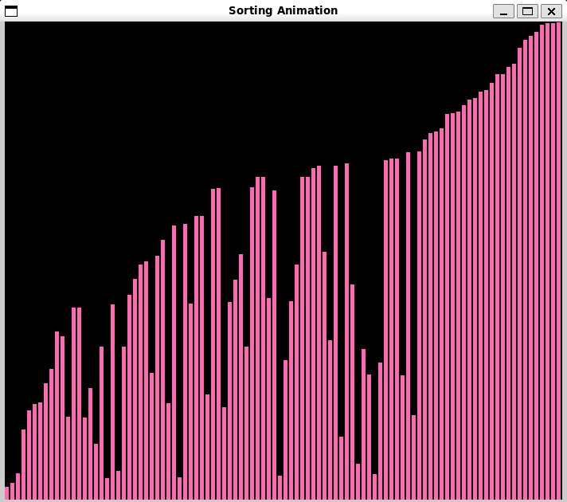
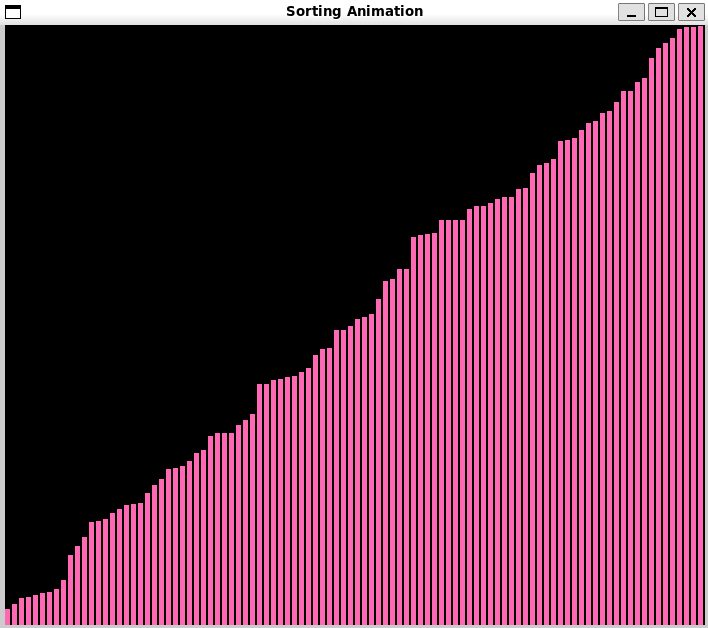

# Sorting Algorithms with Pygame

This project creates a visualization of various sorting algorithms using the Pygame library.

## Getting Started

To get started with this project, follow these steps:

1. Clone the repository:
    ```
    git clone https://github.com/your-username/sorting_anime.git
    ```

2. Navigate to the project directory:
    ```
    cd sorting_anime
    ```

3. Make sure pygame is installed:
    ```
    pip install pygame
    ```

4. Choose which algorithm you want to see in action by uncommenting it out.

5. Run the script:
    ```
    python3 sortingAlgs.py
    ```

Now you can visualize the chosen sorting algorithm using Pygame.

## Sorting Algorithms

The following sorting algorithms are implemented in this project:

- Bubble Sort
- Selection Sort
- Insertion Sort
- Merge Sort
- Quick Sort

## Screenshots

Here are two screenshots of the Quick Sort algorithm in action:


